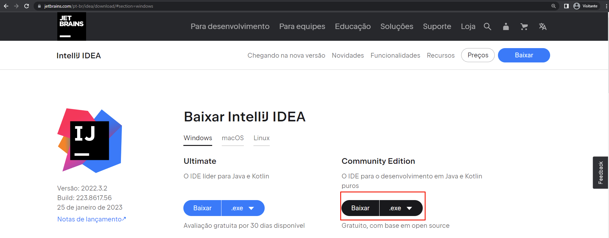
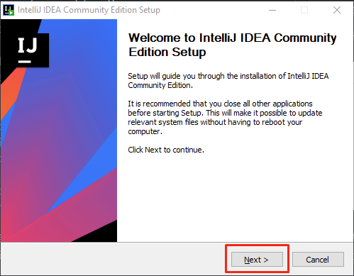
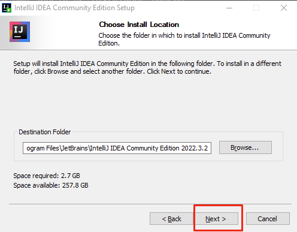
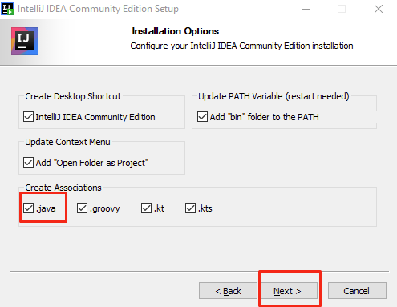
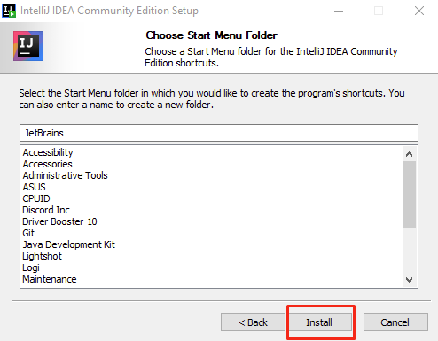
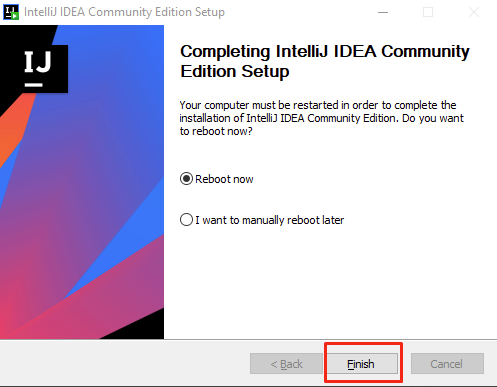

<h1>
    
    IntelliJ IDEA
</h1>

**IntelliJ IDEA** é um ambiente de desenvolvimento integrado e com reconhecimento de contexto 
para trabalhar com **Java** e outras linguagens que rodam na **JVM**, como **Kotlin**, **Scala** e **Groovy**.

`.idea` onde ficam todas as configurações do IntelliJ.

## Atalhos

**`Alt + 1`** Ocultar ou mostrar a view do projeto.

**`Alt + Enter`** Possibilitar ações por meio da feature Show Intention Action - por meio de suas sugestões.

**`Alt + Insert`** Criar algum arquivo.

**`Alt + Shift + Insert`** Modificar o modo de seleção para coluna.

**`Alt + Shift + Setas para cima ou baixo`** Mover linhas de código.

**`Alt + Shift + F10 / Ctrl + Shift + F10`** Executar classe com método `main()`.

**`Alt + F7`** Visualizar onde o código está sendo utilizado.

**`Ctrl + B`** Navegar diretamente até o trecho em que o código foi implementado.

**`Ctrl + D`** Duplicar trecho de código.

**`Ctrl + E`** Visualizar arquivos recentes.

**`Ctrl + H`** Visualizar hierarquia.

**`Ctrl + N`** Pesquisar classe.

**`Ctrl + Y`** Apagar linhas de código.

**`Ctrl + Alt + L`** Formatar o código.

**`Ctrl + Shift + A`** Pesquisar qualquer funcionalidade do IntelliJ.

**`Ctrl + Shift + F`** Pesquisar trechos de código.

**`Ctrl + Shift + N`** Pesquisar arquivos.

**`Ctrl + Shift + Alt + N`** Pesquisar símbolos.

**`Ctrl + Barra(/)`** Comentar código.

**`Shift + F6`** Renomear variáveis.

**`Shift + Shift`** Pesquisar qualquer coisa.

**`F5`** Copiar um arquivo.

**`F6`** Mover um arquivo.

**`"psvm" + Tab`** Implementar o método main.

**`"sout" + Tab`** Implementar o método de impressão.

## Atalhos Debug

**`Alt + Shift + F9 / Ctrl + Shift + D`** Executar o modo debug.

**`F7`** **(Step Into)** Executar cada trecho do código.
- Útil nos trechos de código que queremos entender detalhe por detalhe do que está acontecendo.

**`F8`** **(Step Over)** Executar a linha inteira do código.
- Útil nos trechos de código que queremos apenas avançar sem nos aprofundar mais nas informações internas.

**`Shift + F8`** **(Step Out)** Sair do método em que se está.
- Útil quando entramos, sem querer, dentro de um método que não queremos inspecionar.

## Instalando no Windows

**01.** Entrar na página principal do **[IntelliJ](https://www.jetbrains.com/pt-br/idea/)**, e encontraremos algo parecido 
com a imagem abaixo, onde vamos clicar no botão **"Baixar"**:

Após clicar, seremos levados à página de downloads da ferramenta, que apresenta opções para os sistemas Windows, Linux e 
MacOS em um menu que deve ser clicado baseado no nosso sistema operacional. Logo abaixo do menu vemos duas opções de download, 
que se tratam das duas versões da IDE: a edição **Ultimate** e **Community**.

A versão **Ultimate** apresenta mais recursos, como suporte a mais linguagens e gerenciamento de banco de dados embutido, no 
entanto é paga. A edição **Community** é a opção gratuita da ferramenta.

**02.** Para fazer o download do **IntelliJ Community Edition**, vamos clicar no botão **"Baixar"** como apresentado na imagem 
abaixo:

**03.** Será baixado o instalador da ferramenta, com nome similar a **"ideaIC-2022.3.2"**, dependendo da versão baixada. 
Para iniciar a instalação, vamos executar esse arquivo. Após executado, vai ser aberta uma janela de instalador padrão do 
Windows, como na imagem abaixo, onde vamos clicar no botão **"Next"**:

Que vai nos direcionar para uma página onde vamos selecionar em qual pasta será feita a instalação. Aqui nós podemos 
deixar no diretório padrão e novamente clicar no botão **"Next"**, como mostrado abaixo:

Após isso, seremos direcionados para uma tela com várias caixas de seleção, com opções de instalação da ferramenta. São 
opções referentes à se queremos criar um atalho no desktop, adicionar o IntelliJ ao PATH, para que possa ser acessado via 
linha de comando, adicionar uma nova ação ao menu de contexto, para que quando clicarmos em um arquivo com o botão direito 
do mouse aparece a opção de abri-lo no IntelliJ, e criar associações aos tipos de arquivo, para que eles sejam abertos 
diretamente na IDE.

Aqui podemos selecionar todas as caixas, ou caso não se queira marcar todas as caixas, a mais importante é na aba 
**"Create Associations"**, onde vamos criar as associações dos arquivos .java ao IntelliJ, como destacado na imagem acima. 
Após marcar as opções desejadas, podemos seguir clicando no botão **"Next"**.

Após isso, vamos para a seleção da pasta do menu iniciar onde poderemos localizar a nossa IDE. Nessa tela podemos 
simplesmente deixar a opção padrão e clicar no botão **"Install"** para instalar a ferramenta no computador, como mostrado abaixo:

Ao final da instalação, seremos direcionados a uma tela com a opção de reiniciar o computador agora ou depois. É recomendável 
reiniciar o computador, para que as alterações no PATH funcionem corretamente, no entanto a ferramenta já pode ser utilizada 
mesmo sem a reinicialização.

Por fim, podemos clicar no botão **"Finish"**, para finalizar o instalador, como na imagem abaixo:

## Referências

[IntelliJ IDEA: dicas e truques para usar no dia a dia](https://www.alura.com.br/artigos/intellij-idea-dicas-truques-usar-no-dia-a-dia?_gl=1*1s1t1td*_ga*MTM1MTM4MTY2LjE3MTAxNTMzMTY.*_ga_1EPWSW3PCS*MTcxMDE3NjMxOS40LjEuMTcxMDE3OTM0OS4wLjAuMA..*_fplc*NzdXZE9aR0tHbDV6RjhVS0d2eWg1anpVZFdlZ2IlMkJQWHM2S2hrTDNLZU1zUEFYQ2JYcDlEeTVVd2s0JTJGJTJCMmg2ZWo1Y0liaTBucW90VXNBQXglMkZqVGhiS2o2dyUyRlBNV3lZd3JKNndQMVJNUFhlcjZjVm4yWTUlMkZ4MG1NeGxxMEpRJTNEJTNE)