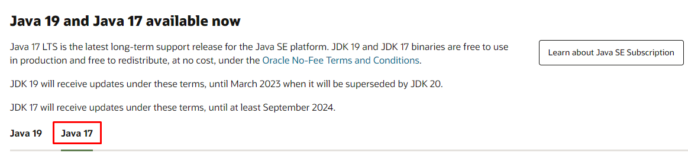
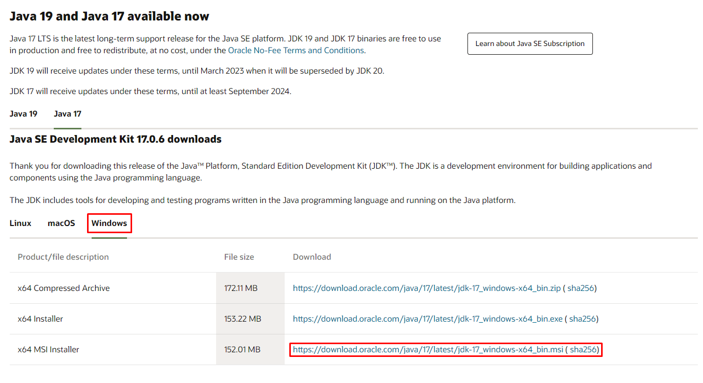
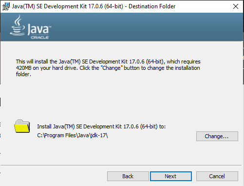
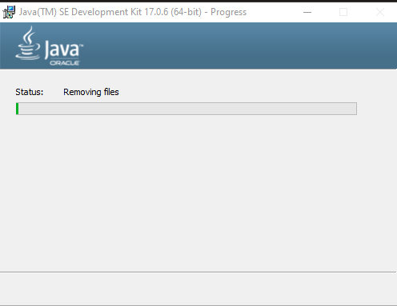
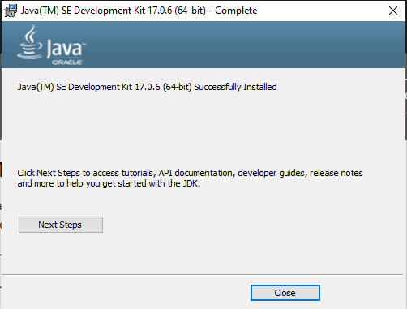
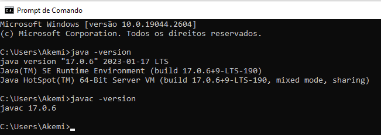
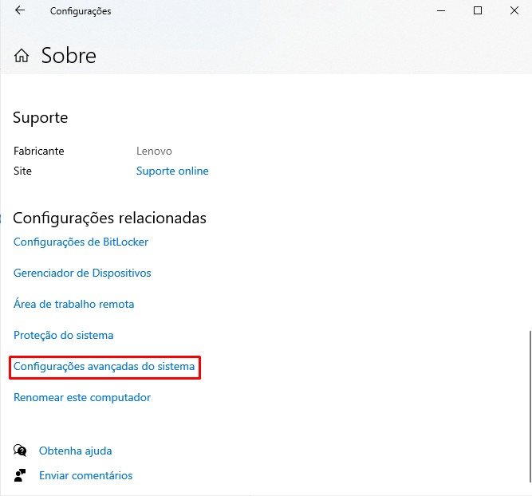
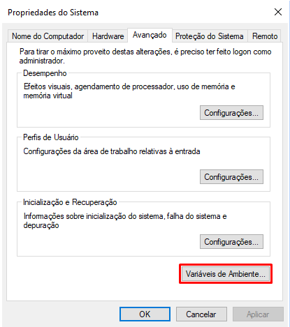
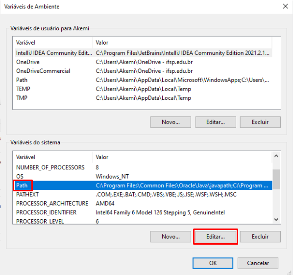
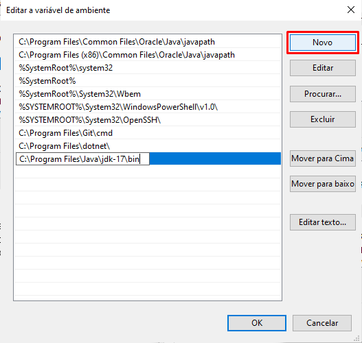

<h1>
    <a href="https://www.oracle.com/java/">
     </a>
    <span>Java</span>
</h1>

### JDK (Java Development Kit)
É um conjunto de ferramentas e bibliotecas de software que permite o desenvolvimento de aplicativos Java.

## Instalando no Windows

**01.** Para instalar no Windows, acessar o site da **[Oracle](https://www.oracle.com/java/technologies/downloads/#jdk21-windows)** 
ou buscar no navegador por **“Java Download Oracle”** e acessar o primeiro link.

**02.** Escolher a versão do Java. 
- Escolher a verssão **LTS**, por ser a versão de suporte de longo prazo mais recente para a plataforma Java SE.



**03.** Selecionar o Windows como sistema operacional e fazer o download.



**04.** Após baixado, executar o instalador e prosseguir com a instalação.







**05.** Após a instalação, vamos testar o nosso Java. Para isso, utilizar o **Prompt de Comando**. Testar os seguintes comandos 
e verificar se tudo correu como o esperado:
```bash
$ java -version

$ javac -version
```

Resultado:



## Configurações do PATH no Windows

**01.** Ir em **Painel de Controle** e procurar por **“Sistema”**, após isso, clicar em **“Configurações avançadas do sistema”**.



**02.** Na aba **"Avançado"**, clicar em **“Variáveis de Ambiente”**.



**03.** Agora foi aberta uma nova janela na parte inferior da tela, selecionar a variável de ambiente chamada **“Path”** e 
clicar em **“Editar”**.



**04.** Nessa nova janela, clicar no botão **“Novo”** e na linha que foi selecionada, colocar o caminho para o diretório 
bin dentro da pasta jdk, que está dentro da pasta Java.



**05.** Após feito, fechar o **Prompt de Comando** e abrir novamente. Testar os seguintes comandos:
```bash
$ java -version

$ javac -version
```